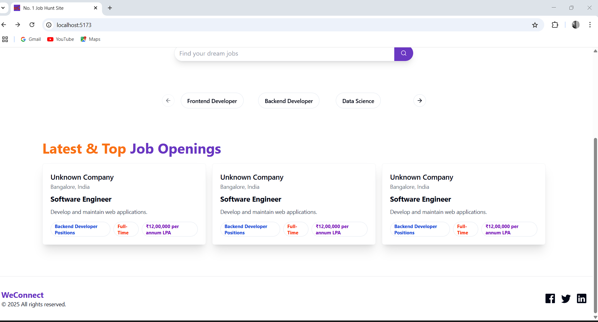

# weConnect 🚀

**weConnect** is a modern, full-stack Job Hunt platform built using the **MERN** stack (MongoDB, Express.js, React.js, and Node.js). It aims to bridge the gap between job seekers and recruiters by providing a smooth and intuitive user experience for both.

## 🌟 Features

### 🧑‍💼 For Job Seekers
- User Registration & Login (JWT Auth)
- Search and filter jobs by title, location, or type
- Apply to jobs with one click
- View application history
- Edit and manage personal profile

### 🏢 For Employers
- Employer Registration & Login
- Post new job listings
- Manage and edit job listings
- View list of applicants for each job

### 🛠️ Admin Dashboard (Coming Soon)
- Manage users and listings
- Monitor platform activity

---


## 📸 Screenshots

### 🏠 Home Page  


### 🔍 Job Search Page  


### 📂 Browse Page  


### 🔐 Login Page  


---

## 🧰 Tech Stack

- **Frontend:** React.js + Tailwind CSS + Vite
- **Backend:** Node.js + Express.js
- **Database:** MongoDB (Mongoose ODM)
- **Authentication:** JWT
- **State Management:**  Redux 

---

## 🚀 Getting Started

### Prerequisites
- Node.js
- MongoDB (local or Atlas)

### Clone the Repo

```bash
git clone https://github.com/prakhaaar/weConnect.git
cd weConnect
